## [(VIEW APP)](https://plant-protector-working.herokuapp.com/)



# Plant-Protector
Mobile App to ease the workload while gardening. Accomplished by using ESP8266 controllers and Web data to inform user to take action in the garden.

This App tracks the growing cycle of your peppers, and provides information on methods to produce the best harvest.

## Installation
## For Mobile
```bash
Clone Repository
```

```bash
npm install
```
```bash
expo start
```
## For Web
```bash
Clone Repository
```
```bash
npm install
```
```bash
expo start --web

### Github Repository

https://github.com/thegroupthatworkz/Plant-Protector.git

## Tools Used

- React with Material Design UI
- Javascript
- HTML
- CSS
- Expo CLI
- ESP8266 controllers
- NodeJS
- Firebase


### Wireframes and Planning


### UX/UI Design

Home Page


Product Page


Information Page


Weather Section


### Initial Design ****USE GIF***** - NEED THESE DESIGNS (MAKE IN AI) 

UX/UI Iterations 


### Final Design ****USE GIF***** - NEED THESE SCREEN SHOTS OF FINAL


### API Server Routes
## Challenges

